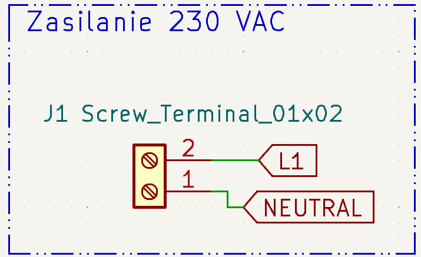
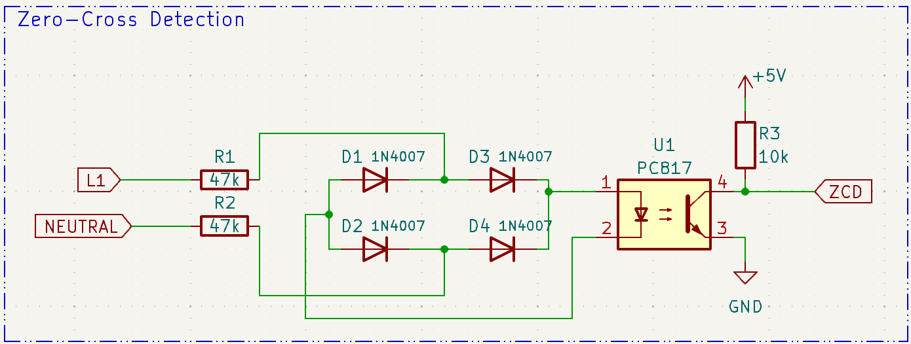
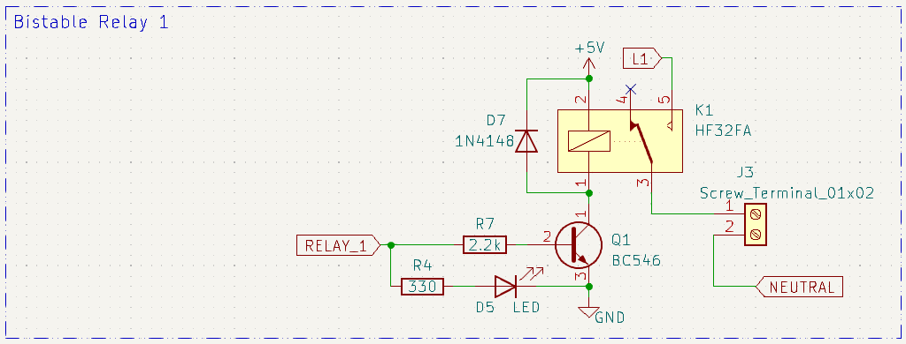
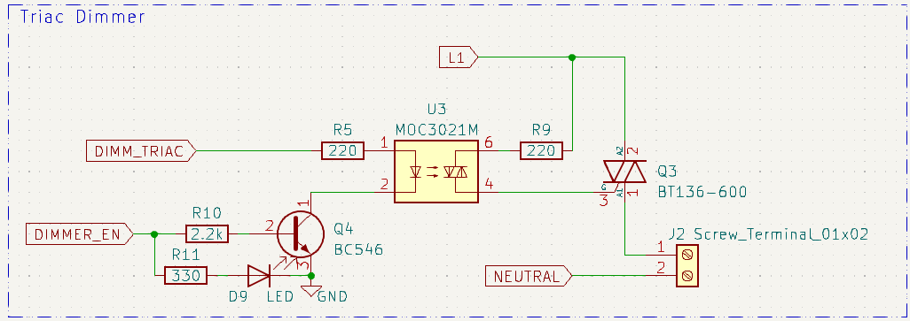
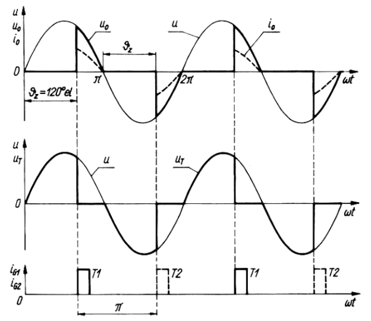
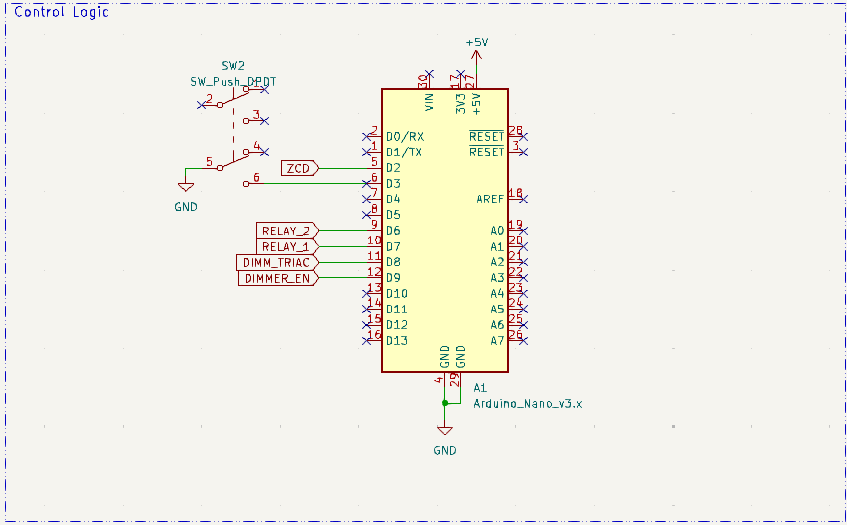
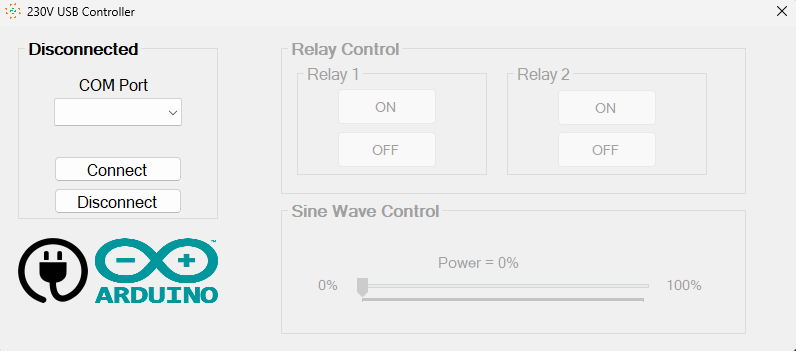

## Contents

- [Introduction](#introduction)
- [Electronics schematics + PCB Layout](#electronics-schematics--pcb-layout)
- [Arduino Code](#arduino-code)
- [Application](#application)


## Introduction

This project was under development during the first semester of Master's Studies at Warsaw University of Technology (Poland) as a final project for Industrial Communication Protocols. Using the UART adaptation of RS-232, a simple controller was created. Its main goal was to make it possible to control a flow of mains current to the load devices. The device contains of two relays for bi-stable control and one triac for more "analogue" control (e.g., a lightbulb dimmer). The heart is an Arduino Nano board.

To make it a complete device with an "easy-to-use" logic, a simple desktop application was created that allows the user to change the states of two included relays and adjust the output voltage of a triac via a slider.

## Electronics schematics + PCB Layout

Electronics schematic was made with KiCad. The whole schematic was divided into six sections to clarify different modules of the device.

### Power section

This section contains only a single screw terminal for mains voltage connection. Through this terminal, the mains voltage/current are later delivered to the load devices. 

Disclaimer:\
"Zasilanie 230 VAC" means "230 VAC power supply". 

<p align="center">
  
</p>

### Zero-cross detection

This section, one of the most important, is responsible for detecting the moment when a mains voltage's sine wave is crossing its zero point. As shown in the image given below, as the sine wave has a non-zero value, the optocouple is pulling the ZCD voltage to ground, but at the time the sine has a value of **zero** the ZCD voltage is pulled high through the 10k resistor $R_3$.

<p align="center">
  
</p>

### Bistable relay

Both of these relays are used to control the power delivery for any load that works with mains voltage. Moreover, it is possible to control any device that takes the mains voltage as the binary control input.

For additional protection, a BJT transistor was used as an element responsible for activating the relay's coil.

<p align="center">
  
</p>

### Triac dimmer

When the dimmer module is enabled by setting the _DIMMER_EN_ voltage to HIGH, the optotriac diode is connected to ground, completing the circuit. Then, for a specific period of time, the _DIMM_TRIAC_ voltage is set to HIGH, activating the optotriac. This behavior results in the main triac activating for a specified time, resulting in delivering a specified amount of power to the connected load.

<p align="center">
  
</p>

<p align="center">
  
</p>

#### <u>IMPORTANT</u>

Because the project utilizes a triac, only a resistive load is recommended to avoid the appearance of so-called **tail current**.

### Control logic

A simple schematic for an Arduino with a drawn pinout. Nothing special, to be honest :sweat_smile:. A button was added to enable and disable dimmer, although the MCU can be reprogrammed to utilize this switch differently.

<p align="center">
  
</p>

### PCB Layout

The PCB was designed the way it is presented on the picture below. Both sides of board were utilized, but most of the traces are located on the front. The were two main goals while designed such layout:
1. Relatively compact size
2. Visible separation of mains AC volatage from the control +5 volts. There is no physical gap between them, but the PCB was designed in such way that control voltage occupies one side of the PCB and the main voltage - the other side.

The layout can be viewed using one of the free PCB design software, for example KiCad.


## Arduino code

Code written for an ATmega328P microcontroller (on an Arduino board) is not anything sophisticated, although it utilizes an ISR for accurate zero-cross detection of mains voltage sine wave.

For communication, it uses a USB protocol (and a USB <> UART transcoder)  which, by transmitting and receiving characters, can be controlled by an external desktop app.

In the source code, there is also a potentiometer pinout definition ```#define POT A0```, which was used for manual testing of the dimmer code + circuit combination before the development of the app. It was mounted only on the prototype board (manually soldered on the perfboard) and is not included in the final project. 

The range of a triac activation delay (```triac_delay```) was selected with a so-called trial-and-error method. Values exceeding the range of 300–9000 have been marked as causing the dimmer to be unstable. Feel free to experiment with this range, however please be careful.

## Application

It's a simple application - nothing revolutionary, although it was a pretty good micro challenge, which surely gave me an insight into making an app communicating with an external device.

When the app is opened, firstly, an appropriate COM port has to be selected using the combo box and then, by clicking the "Connect" button, the app will (or not if an invalid COM was selected) connect itself with a device, thus enabling the control section (right-hand side of the app's screen). 

<p align="center">
  
</p>

By clicking the "ON" and "OFF" buttons, you can change the state of both relays, respectively. The section below, called "Sine Wave Control", is responsible, as the name suggests, for adjusting the power delivered to the dimmer and its load (read the important warning in the [Triac dimmer](#triac-dimmer) section). 

If the connection is lost or the app is closed without disconnecting, all the relays are turned off and the dimmer power is set to 0%.
